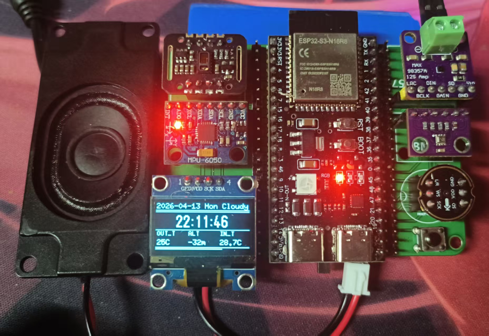
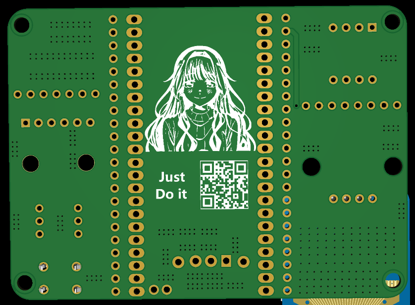

# MoYu Badge

基于 `ESP32-S3` 的多功能 Badge 固件项目，集成时钟天气、血氧心率、体感游戏、网络电台、录音回放、Wi-Fi 配网、OneNET 上报和 OTA 升级能力。

项目演示视频：[B 站 Demo](https://www.bilibili.com/video/BV14hXEBbEjP)
<p align="center">
  
  
</p>

## 快速跳转

- [功能概览](#功能概览)
- [开发手册](#开发手册)
- [用户手册](.doc/docs/用户使用手册.md)
- [硬件说明](#硬件说明)

## 功能概览

- 多页面本地 UI：时钟、设置、血氧、电台、录音、游戏等模式统一管理
- 传感器融合：`MPU6050`、`BMP280`、`MAX30102` 按页面按需启停
- 网络能力：Wi-Fi 自动连接、AP 配网、Captive Portal、OneNET 上报、OTA
- 音频能力：HTTP 拉流、MP3 解码、I2S 播放、麦克风录音回放
- 交互方式：单按键短按 / 长按 / 超长按 + 姿态倾斜输入
- 功耗管理：普通页面自动休眠，电台播放时支持仅息屏不停止后台播放

### 项目要点

- 基于 `ESP-IDF + FreeRTOS` 的多任务架构，不是单循环 Demo
- UI、业务逻辑、驱动模块按组件拆分，便于扩展和维护
- 音频链路包含缓冲、去毛刺、平滑、淡入等处理
- 录音退出时主动释放 `PSRAM`，降低对电台模式的内存影响
- 使用双 OTA 分区，具备完整在线升级路径

## 开发手册

### 开发环境

- `ESP-IDF v5.3.4`
- `FreeRTOS`
- `VSCode`

### 常用命令

```bash
idf.py build
idf.py -p COMx flash
idf.py -p COMx monitor
```

如构建缓存异常：

```bash
idf.py fullclean
idf.py reconfigure
idf.py build
```

### 目录结构

- `main/`：应用入口与主组件注册
- `components/app/`：UI、模式切换、联网业务、电台、录音等上层逻辑
- `components/modules/`：OLED、IMU、BMP280、MAX30102、INMP441、MAX98357、WS2812 等模块驱动
- `components/bsp/`：I2C、延时等基础 BSP
- `components/app/ap_wifi/html/`：配网页面资源
- `partitions_webserver.csv`：分区表

### FreeRTOS 要点

- 主入口统一创建后台任务：
  - `start_sync_task`
  - `start_sensor_task`
  - `start_oled_task`
  - `start_key_task`
  - `start_onenet_task`
- 任务协同方式：
  - `EventGroup`：同步 Wi-Fi 连接和时间同步状态
  - `Mutex / Semaphore`：保护音频缓冲区、OTA HTTP 请求等共享资源
  - `Task Notification`：用于部分音频任务唤醒和状态切换
- 资源策略：
  - 任务常驻，硬件按页面启停
  - 传感器按 `ui_mode` 动态启停
  - 电台和录音使用独立后台任务，避免阻塞 UI

### 开发注意事项

- `main/CMakeLists.txt` 中必须把 `main.c` 放到 `SRCS`
- 请在正确导出 ESP-IDF 环境变量的终端中构建
- 电台和录音都涉及较大内存分配，修改时注意 `PSRAM` 生命周期
- 配网页面通过 `SPIFFS` 打包，修改 HTML 后需要重新构建镜像


## 硬件说明

| 模块 | 作用 |
| --- | --- |
| ESP32-S3 | 主控，负责 UI、联网、任务调度、音频与业务逻辑 |
| OLED | 图形界面显示 |
| MPU6050 | 姿态检测、体感输入 |
| BMP280 | 温度、气压、海拔测量 |
| MAX30102 | 心率、血氧检测 |
| INMP441 | 麦克风录音输入 |
| MAX98357 | 音频播放输出 |
| WS2812 | 状态灯效 |
| 独立按键 | 菜单操作、确认、唤醒 |

### 分区说明

- `nvs`：参数与配置存储
- `otadata`：OTA 状态数据
- `ota_0 / ota_1`：双分区 OTA 固件
- `html`：配网页面静态资源
